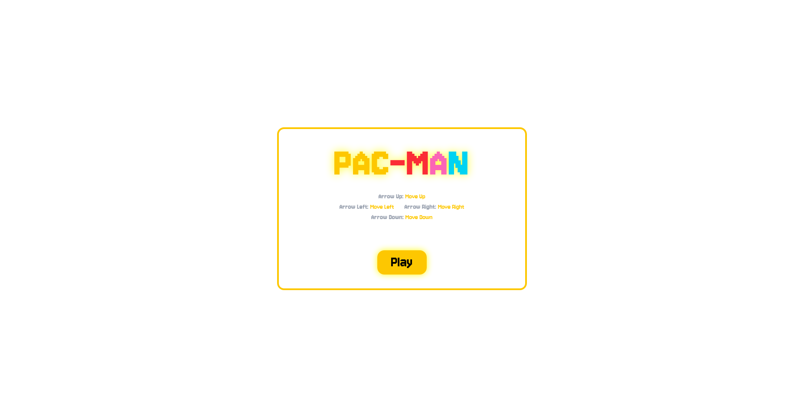
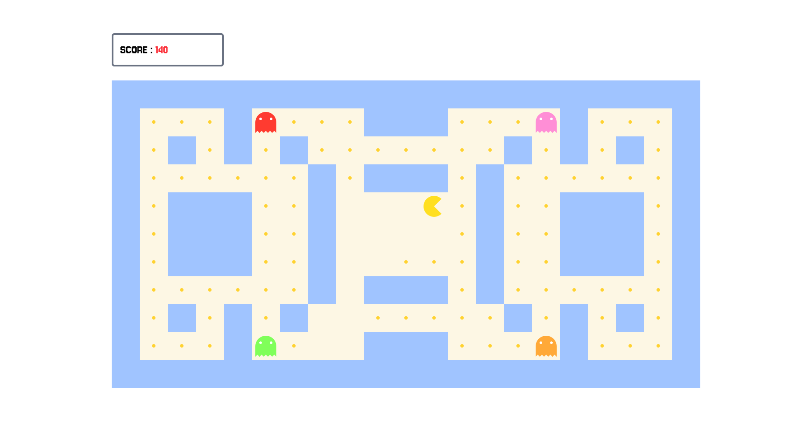
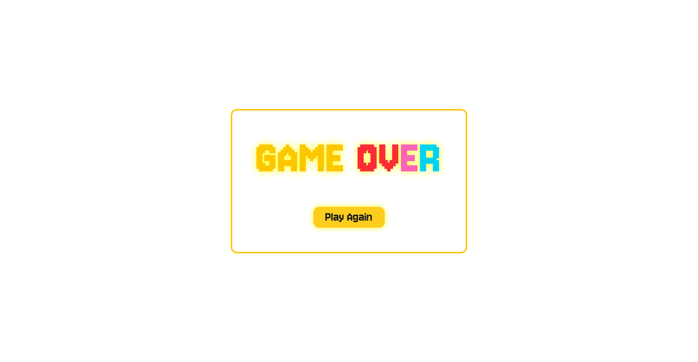
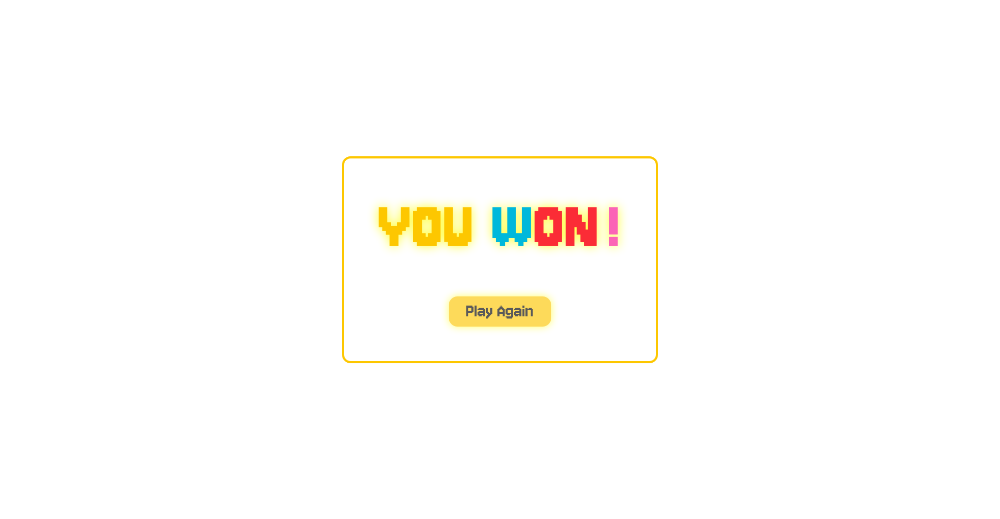

# Tetris

A simple **Pac Man clone** built with **React** ...

---

## Technical Stack

<div align="center">

| Icon                                                                                                          | Technology       | Purpose        |
| ------------------------------------------------------------------------------------------------------------- | ---------------- | -------------- |
|  | **TypeScript**   | Type safety    |
|            | **React**        | User interface |
|                    | **Tailwind CSS** | Styling        |

</div>

---

## Main Features

### Start a New Game



### Play, Score Points and Avoid Monsters



### Game Over / Victory — Start Again





### Pathfinding

**Pathfinding** is implemented using **Dijkstra’s algorithm**, with **cached optimal paths** used to efficiently move the monsters.


---

## How to Start the App

### 1. Clone repository

```bash
git clone <your-repo-url>
cd pac-man
```

### 2. Install dependencies

Install npm packages:

```bash
npm install
```

### 3. Run the project

```bash
npm run dev
```

---

The application should now be running locally.
